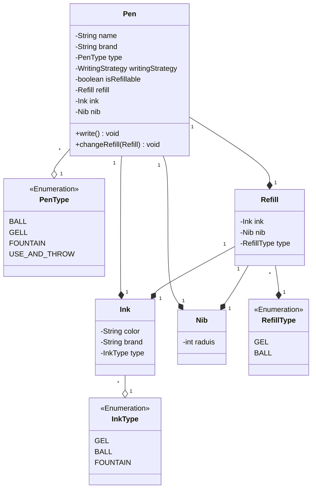
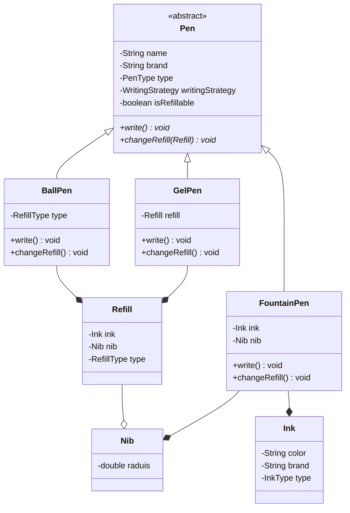
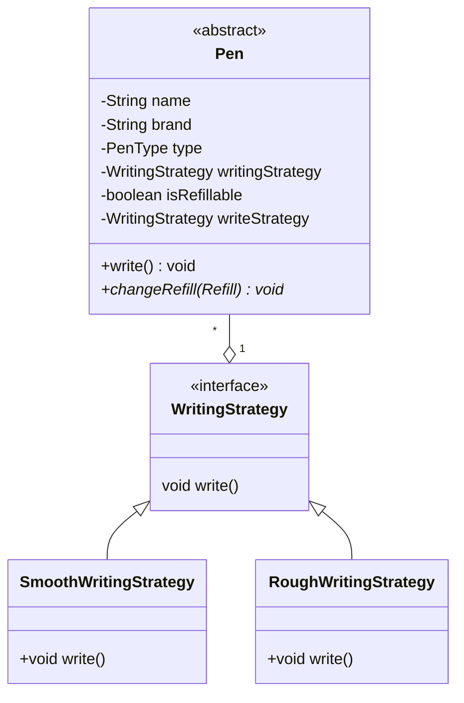

### Design a pen
* Requirements
* A pen is anything that can write.
* Pen can be Gel, Ball, Fountain, Marker.
* Ball Pen and Gel Pen have a Ball Pen Refill and a Gel Pen Refill respectively to write.
* A refil has a tip and an ink.
* Ink can be of different colour
* A fountain pen has an Ink.
* Refill has a radius.
* For fountain pen, its tip has a radius.
* Each pen can write in a different way.
* Some pens write in the same way.
* Every pen has a brand and a name.
* Some pens may allow refilling while others might not.
# Entities and Attributes.
# Pen
 * Brand
 * Name
* Type (Gel, Ball, Fountain, Marker)
* Price
* Refill
* Type (Ball, Gel)
* Ink
* Nib
* Ink
* Colour
* Brand
Type (Gel, Ball, Fountain)
Nib
Radius
Type (Fountain, Ball, Gel)
Different types of pens
Gel Pen

Type - Gel
Refill
Type - Gel
Nib - Gel
Ink
Type - Gel
Refillable - Yes
Ball Pen

Type - Ball
Refill
Type - Ball
Nib - Ball
Ink
Type - Ball
Refillable - Yes
Throwaway Pen

Type - Throwaway
Refill
Type - Ball
Nib - Ball
Ink
Type - Ball
Refillable - No
Fountain Pen

Type - Fountain
Ink
Type - Fountain
NiB
Type - Fountain

## Optimised design

# Reducing code duplication using strategy design patter
1. Create strategy interface 
2. create concrete strategies and 
3. Compose a pen class with strategy

